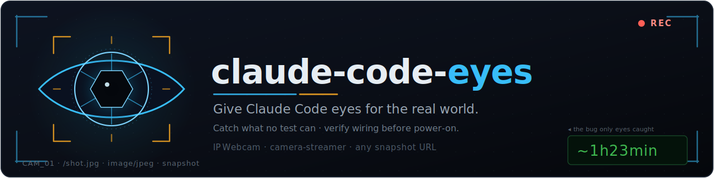

<p align="center">
  
</p>

# claude-code-eyes

**A Claude Code skill that lets Claude *look* at the real world through a camera** —
your desk, a breadboard, a display panel, a rack of wires — and answer from what it
actually sees.

Most of what Claude works with is text: code, logs, API responses. But some
outputs live where no test can reach them. A font that silently drops characters.
A wire in the wrong hole. A number clipped at the edge of an LCD. `claude-code-eyes`
grabs the current camera frame so Claude can read it like any other file.

---

## Get a camera in 2 minutes (recommended: IP Webcam)

The primary, best-supported camera source is the **IP Webcam** Android app — it
turns any spare Android phone into an HTTP snapshot camera.

1. **Install it from Google Play:**
   👉 **https://play.google.com/store/apps/details?id=com.pas.webcam**
2. Open the app, scroll to the bottom, and tap **Start server**.
3. The app shows an address on screen, e.g. `http://192.168.0.42:8080`. That
   `IP:port` is your camera URL.
4. Point the phone at whatever you want Claude to see (a phone stand or a stack of
   books works). Set the config below to that URL.

```bash
export CCE_CAM_TYPE=ipwebcam
export CCE_CAM_URL=http://192.168.0.42:8080      # the IP:port the app shows
# optional, if you enabled "Login/password" in the app:
# export CCE_CAM_AUTH=user:pass
```

No Android phone? Any camera that can serve a still image over HTTP works — see
[Camera backends](#camera-backends) for a Raspberry Pi or a fully generic snapshot
URL.

---

## Install

The skill is a folder with a `SKILL.md` and a `snap.sh`. Put it where Claude Code
looks for skills:

**Personal (all your projects):**
```bash
git clone https://github.com/fcavalcantirj/claude-code-eyes.git \
  ~/.claude/skills/claude-code-eyes
```

**Project-scoped (shared with a repo):**
```bash
git clone https://github.com/fcavalcantirj/claude-code-eyes.git \
  /path/to/your/project/.claude/skills/claude-code-eyes
```

Or just copy the skill's files into a `claude-code-eyes/` folder under either
`skills/` location. That's the whole skill.

### One-command setup

From the installed skill folder, run the setup helper — it writes your camera
config and grabs a test frame, so there's nothing to hand-edit:

```bash
bash ~/.claude/skills/claude-code-eyes/setup.sh
```

It asks for your camera URL — or, if you leave it blank, **scans your LAN for an
IP Webcam** and lets you pick one. Prefer non-interactive?

```bash
# writes the config and verifies it in one shot (add --auth user:pass if needed)
bash ~/.claude/skills/claude-code-eyes/setup.sh --url http://192.168.0.42:8080 --type ipwebcam
```

Other flags: `--scan` (just list IP Webcams on the LAN), `--local` (write
`./.cce.env` for this project instead of the global config), `--show` (where config
lives). You can still set the env vars or edit the config by hand — see
[Configuration](#configuration--precedence).

Then ask Claude to look:

> "Are you seeing this? Is the yellow wire in G4?"
> "Look at the display — does it say `~1h23min` in full?"
> "Watch this — I'm going to press the button."

---

## What it's for

### Visual-verify — catch what green tests cannot
A rendered screen is an output no unit test can see. Snap **before and after** a
render change and diff the frames; check the frame **against what the spec/API says
the screen should show**; report the mismatch. It has a small case library baked
into the skill: font coverage / dropped characters, text-vs-graphic collisions,
clipping at a panel edge, and stale-vs-live renders.

### Wiring-mentor — a second set of eyes before power-on
Ask Claude to check a build's wiring against its wiring table before you apply
power: it calls out mismatches, verifies polarity and voltage rails (no 5 V on a
3.3 V-only pin), and — importantly — **refuses to guess a pin it can't read**,
asking you to aim the camera closer instead.

---

## Camera backends

Selected with `CCE_CAM_TYPE`:

| `CCE_CAM_TYPE` | Source | Request |
|---|---|---|
| `ipwebcam` | Android **IP Webcam** app | `GET $CCE_CAM_URL/shot.jpg` |
| `camera-streamer` | Raspberry Pi [camera-streamer](https://github.com/ayufan/camera-streamer) | `GET $CCE_CAM_URL/snapshot` |
| `url` *(default)* | **Anything** that returns a still image over HTTP | `GET $CCE_CAM_URL` (verbatim) |

The `url` mode is the escape hatch: point it at any endpoint that returns a JPEG or
PNG (a webcam server, an ESP32-CAM, a signed snapshot URL, `?action=snapshot`,
etc.). `snap.sh` verifies the response is actually an image (by magic bytes), so a
web page served with `200 OK` won't be mistaken for a photo.

```bash
# Raspberry Pi camera-streamer
export CCE_CAM_TYPE=camera-streamer
export CCE_CAM_URL=http://raspberrypi.local:8080

# Any snapshot URL
export CCE_CAM_TYPE=url
export CCE_CAM_URL=http://192.168.0.50/cam/snapshot.jpg
```

### Experimental: local USB webcam (untested — verify it yourself)

If you have a USB/built-in webcam and `ffmpeg` installed, you can grab a single
frame directly. **This is not shipped as a `snap.sh` backend** because it can't be
tested in an automated/headless environment (macOS in particular blocks camera
access behind an interactive permission prompt). The portable, supported path is a
snapshot URL via one of the backends above. If you want to wire a local camera in
yourself, these are the one-liners:

```bash
# macOS (avfoundation) — index 0 is usually the built-in camera
ffmpeg -y -loglevel error -f avfoundation -framerate 30 -i "0:none" -frames:v 1 out.jpg

# Linux (v4l2)
ffmpeg -y -loglevel error -f v4l2 -i /dev/video0 -frames:v 1 out.jpg
```

Grant your terminal camera permission first, run it manually, and confirm `out.jpg`
is a real image before trusting it.

---

## Configuration & precedence

Set config however you like — `snap.sh` resolves it in this order (first wins):

1. **Environment variables** already exported in your shell.
2. **`./.cce.env`** in the current working directory.
3. **`${XDG_CONFIG_HOME:-$HOME/.config}/claude-code-eyes/config`**.

Config files only *fill in* values you haven't already exported, and they are
**read, never executed** (`snap.sh` parses `KEY=VALUE` for a fixed allowlist of
keys — a config file cannot run code or set anything else). Example `.cce.env`:

```ini
CCE_CAM_TYPE=ipwebcam
CCE_CAM_URL=http://192.168.0.42:8080
# CCE_CAM_AUTH=user:pass
```

| Key | Meaning |
|---|---|
| `CCE_CAM_URL` | Camera URL (interpreted per `CCE_CAM_TYPE`) |
| `CCE_CAM_AUTH` | Optional HTTP basic auth `user:pass` |
| `CCE_CAM_TYPE` | `ipwebcam` \| `camera-streamer` \| `url` (default `url`) |

### Watch mode
```bash
bash snap.sh 3 2     # 3 frames, 2 seconds apart — for "watch this"
```

Captured frames are written under `${TMPDIR:-/tmp}/claude-code-eyes/` and their
paths are printed one per line.

---

## Why this exists

During a hardware build, a 48-pixel clock font on a small display contained only
the glyphs `0-9 : . - a p m`. Handed the string `~1h23min`, it rendered **`1 24m`**
on the panel — the `~`, `h`, `i`, and `n` were dropped **silently**. Every
automated layer was green, and every one of them was *right*: the string was
composed correctly, fetched correctly, and the test asserting "these bytes are
ASCII" passed — because the bytes genuinely were ASCII. The narrow thing was the
font's glyph coverage, which lives on the glass and nowhere else.

The only instrument that could see it was a camera pointed at the panel. That's
what this skill is: a way to give Claude eyes for the outputs that don't fit in a
terminal — and, just as important, the discipline to **know what an instrument can
and cannot see** (a blank frame is not a "no" until the camera is proven to be
looking).

---

## License

MIT — see [LICENSE](LICENSE).
