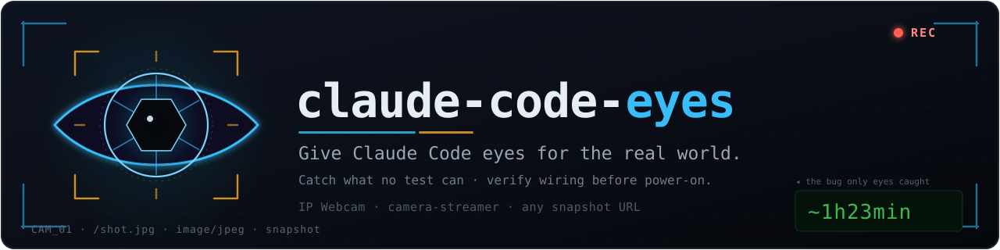

<p align="center">
  
</p>

# claude-code-eyes

**Give Claude Code eyes.** A camera skill so Claude doesn't just *read about* your
hardware — it **sees** it and drives the whole loop: write the firmware, flash the
board, connect the API, look at the display, fix the UI, reflash — **verifying its
own work where it actually lives: on the glass.**

> **Built by a quadriplegic dev who watched Claude Code wire up an ESP32 and fix its on-screen UI — by _looking_.** This skill is how Claude sees.

Most of what Claude works with is text: code, logs, API responses. But some outputs
live where no test can reach them — a font that silently drops characters, a wire in
the wrong hole, a number clipped at the edge of an LCD. `claude-code-eyes` grabs the
current camera frame so Claude can read it like any other file — then **act on it**:
edit, reflash, and look again until the real thing is right.

🔍 **New in v1.1 — Claude can [zoom the lens](#zoom-in--read-whats-too-small-to-see).**
Too small to read? It zooms in and looks again instead of guessing, then puts the
camera back where it found it. Chip markings, resistor bands, silkscreen, fine print.

## Releases

| Version | |
|---|---|
| **[v1.1.1](https://github.com/fcavalcantirj/claude-code-eyes/releases/tag/v1.1.1)** | LAN cameras bypass the proxy |
| **[v1.1.0](https://github.com/fcavalcantirj/claude-code-eyes/releases/tag/v1.1.0)** | Claude can zoom the lens |
| **[v1.0.0](https://github.com/fcavalcantirj/claude-code-eyes/releases/tag/v1.0.0)** | First public release — Claude sees through your camera |

## See it in action

<p align="center">
  
</p>

▶️ **[Watch the full 25-second demo](https://drive.google.com/file/d/1z-ocjd7T9SdrBK2IVM4ku4vXrFHbrH6i/view)** — Claude drives the build from the laptop, the board runs the live countdown, and the phone (IP Webcam) is the eye Claude looks through.

> 🤯 **What Claude Code pulled off here** — from a prompt, my home Wi-Fi, and the API it would use, and with **zero hardware help from me**: it designed the board → relay → API architecture, wrote the ESP32 firmware *and* a Go relay service, flashed the board, shipped **5 clean OTA updates**, wrote its own tests (and caught two of its own that were testing nothing) — and **found and fixed a UI bug on the display that every green test missed, by *looking* at the panel through this camera.** My whole job: set the goal, plug in the cable, press the button, aim the phone. Claude did the engineering.

---

## Get a camera in 2 minutes (recommended: IP Webcam)

The primary, best-supported camera source is the **IP Webcam** Android app — it
turns any spare Android phone into an HTTP snapshot camera.

1. **Install it from Google Play:**
   👉 **https://play.google.com/store/apps/details?id=com.pas.webcam**
2. Open the app, scroll to the bottom, and tap **Start server**.
3. The app shows an address on screen, e.g. `http://192.168.0.42:8080`. That
   `IP:port` is your camera URL.
4. Point the phone at whatever you want Claude to see (a phone stand or a stack of
   books works). Set the config below to that URL.

```bash
export CCE_CAM_TYPE=ipwebcam
export CCE_CAM_URL=http://192.168.0.42:8080      # the IP:port the app shows
# optional, if you enabled "Login/password" in the app:
# export CCE_CAM_AUTH=user:pass
```

No Android phone? Any camera that can serve a still image over HTTP works — see
[Camera backends](#camera-backends) for a Raspberry Pi or a fully generic snapshot
URL.

---

## Install

The skill is a folder with a `SKILL.md` and a `snap.sh`. Put it where Claude Code
looks for skills:

**Personal (all your projects):**
```bash
git clone https://github.com/fcavalcantirj/claude-code-eyes.git \
  ~/.claude/skills/claude-code-eyes
```

**Project-scoped (shared with a repo):**
```bash
git clone https://github.com/fcavalcantirj/claude-code-eyes.git \
  /path/to/your/project/.claude/skills/claude-code-eyes
```

Or just copy the skill's files into a `claude-code-eyes/` folder under either
`skills/` location. That's the whole skill.

### One-command setup

From the installed skill folder, run the setup helper — it writes your camera
config and grabs a test frame, so there's nothing to hand-edit:

```bash
bash ~/.claude/skills/claude-code-eyes/setup.sh
```

It asks for your camera URL — or, if you leave it blank, **scans your LAN for an
IP Webcam** and lets you pick one. Prefer non-interactive?

```bash
# writes the config and verifies it in one shot (add --auth user:pass if needed)
bash ~/.claude/skills/claude-code-eyes/setup.sh --url http://192.168.0.42:8080 --type ipwebcam
```

Other flags: `--scan` (just list IP Webcams on the LAN), `--local` (write
`./.cce.env` for this project instead of the global config), `--show` (where config
lives). You can still set the env vars or edit the config by hand — see
[Configuration](#configuration--precedence).

Then ask Claude to look:

> "Are you seeing this? Is the yellow wire in G4?"
> "Look at the display — does it say `~1h23min` in full?"
> "Watch this — I'm going to press the button."

---

## What it's for

### Visual-verify — catch what green tests cannot
A rendered screen is an output no unit test can see. Snap **before and after** a
render change and diff the frames; check the frame **against what the spec/API says
the screen should show**; report the mismatch. It has a small case library baked
into the skill: font coverage / dropped characters, text-vs-graphic collisions,
clipping at a panel edge, and stale-vs-live renders.

### Zoom in — read what's too small to see
Claude drives the lens itself. When a marking, band, or line of text won't resolve,
it zooms and takes another look rather than reporting a guess or "the image is too
blurry":

```bash
bash snap.sh --zoom 5      # 5x, capture, then restore the previous zoom
bash snap.sh --focus       # soft rather than small? autofocus, then capture
```

`--zoom` is a plain magnification from **1 to 10**, snapped to a step your camera
actually supports, and the previous level is **restored afterwards** — so a zoomed
look never silently changes what the next capture sees. Needs
`CCE_CAM_TYPE=ipwebcam`; other backends say so and still capture. [Full
details ↓](#zoom-and-focus)

### Wiring-mentor — a second set of eyes before power-on
Ask Claude to check a build's wiring against its wiring table before you apply
power: it calls out mismatches, verifies polarity and voltage rails (no 5 V on a
3.3 V-only pin), and — importantly — **refuses to guess a pin it can't read**,
zooming in for a better look and asking you to aim the camera closer if that still
isn't enough.

---

## Camera backends

Selected with `CCE_CAM_TYPE`:

| `CCE_CAM_TYPE` | Source | Request |
|---|---|---|
| `ipwebcam` | Android **IP Webcam** app | `GET $CCE_CAM_URL/shot.jpg` |
| `camera-streamer` | Raspberry Pi [camera-streamer](https://github.com/ayufan/camera-streamer) | `GET $CCE_CAM_URL/snapshot` |
| `url` *(default)* | **Anything** that returns a still image over HTTP | `GET $CCE_CAM_URL` (verbatim) |

The `url` mode is the escape hatch: point it at any endpoint that returns a JPEG or
PNG (a webcam server, an ESP32-CAM, a signed snapshot URL, `?action=snapshot`,
etc.). `snap.sh` verifies the response is actually an image (by magic bytes), so a
web page served with `200 OK` won't be mistaken for a photo.

```bash
# Raspberry Pi camera-streamer
export CCE_CAM_TYPE=camera-streamer
export CCE_CAM_URL=http://raspberrypi.local:8080

# Any snapshot URL
export CCE_CAM_TYPE=url
export CCE_CAM_URL=http://192.168.0.50/cam/snapshot.jpg
```

### Experimental: local USB webcam (untested — verify it yourself)

If you have a USB/built-in webcam and `ffmpeg` installed, you can grab a single
frame directly. **This is not shipped as a `snap.sh` backend** because it can't be
tested in an automated/headless environment (macOS in particular blocks camera
access behind an interactive permission prompt). The portable, supported path is a
snapshot URL via one of the backends above. If you want to wire a local camera in
yourself, these are the one-liners:

```bash
# macOS (avfoundation) — index 0 is usually the built-in camera
ffmpeg -y -loglevel error -f avfoundation -framerate 30 -i "0:none" -frames:v 1 out.jpg

# Linux (v4l2)
ffmpeg -y -loglevel error -f v4l2 -i /dev/video0 -frames:v 1 out.jpg
```

Grant your terminal camera permission first, run it manually, and confirm `out.jpg`
is a real image before trusting it.

---

## Configuration & precedence

Set config however you like — `snap.sh` resolves it in this order (first wins):

1. **Environment variables** already exported in your shell.
2. **`./.cce.env`** in the current working directory.
3. **`${XDG_CONFIG_HOME:-$HOME/.config}/claude-code-eyes/config`**.

Config files only *fill in* values you haven't already exported, and they are
**read, never executed** (`snap.sh` parses `KEY=VALUE` for a fixed allowlist of
keys — a config file cannot run code or set anything else). Example `.cce.env`:

```ini
CCE_CAM_TYPE=ipwebcam
CCE_CAM_URL=http://192.168.0.42:8080
# CCE_CAM_AUTH=user:pass
```

| Key | Meaning |
|---|---|
| `CCE_CAM_URL` | Camera URL (interpreted per `CCE_CAM_TYPE`) |
| `CCE_CAM_AUTH` | Optional HTTP basic auth `user:pass` |
| `CCE_CAM_TYPE` | `ipwebcam` \| `camera-streamer` \| `url` (default `url`) |
| `CCE_OUT_DIR` | Where frames are written (default `./.claude-code-eyes`) |

### Zoom and focus

When you can't read a silkscreen label, a resistor band, or a chip marking, zoom
in and look again instead of guessing:

```bash
bash snap.sh --zoom 4        # 4x, capture, then restore the previous zoom
bash snap.sh --focus         # trigger autofocus, then capture
bash snap.sh --zoom 6 3 2    # 6x + watch mode: 3 frames, 2s apart
```

`--zoom` takes a **magnification from 1 to 10**, not raw device units, and snaps
to the nearest step the camera actually supports. The previous zoom is **restored
after the capture** (including on Ctrl-C), so a zoomed shot never silently changes
what the next one sees.

Needs `CCE_CAM_TYPE=ipwebcam`. Other backends say so and still capture the frame.

| Backend | Snapshot | Zoom | Focus |
|---|---|---|---|
| `ipwebcam` | yes | **yes** | **yes** |
| `camera-streamer` | yes | no | no |
| `url` | yes | no | no |

<details>
<summary>How it works on the device — verified 2026-08-20, and two traps</summary>

| Purpose | Endpoint | Notes |
|---|---|---|
| Set zoom | `/settings/zoom?set=V` | **absolute**; V must be an allowed step, `100`=1x … `1000`=max |
| Set zoom | `/ptz?zoom=P` | **percent 0–100** of the range — *not* an absolute value |
| Focus | `/focus`, `/nofocus` | momentary trigger; `focusmode` is unchanged |
| Capabilities | `/status.json?show_avail=1` | the device's own allowed zoom steps |

Success is signalled by the response **body containing `Ok`** — the status code is
`200` either way, so checking the code alone is not enough.

**Trap 1: `/ptz?zoom=` is a percentage.** `/ptz?zoom=200` does not mean 2x — it
clamps to maximum zoom. This skill uses `/settings/zoom?set=` instead.

**Trap 2: `curvals.zoom` lags several seconds** behind a change. Code that reads it
straight back sees the *old* value, so restoring from an immediate read restores the
wrong level. `snap.sh` polls until the value settles.

Note: `pydroid-ipcam` documents zoom as `/settings/ptz?zoom=N`; that path returns
**404** on the device tested here.

</details>

### Watch mode
```bash
bash snap.sh 3 2     # 3 frames, 2 seconds apart — for "watch this"
```

Captured frames are written under `./.claude-code-eyes/` (override with
`CCE_OUT_DIR`) and their paths are printed one per line. They land in the working
directory, not `$TMPDIR`, on purpose — see the sandbox note below.

---

## Troubleshooting: the camera stopped working after a Claude Code update

Claude Code runs Bash commands inside a [sandbox](https://code.claude.com/docs/en/sandboxing).
It changed two things this skill depends on. Both are handled as of the current
version, but if you are on an older copy — or you see the symptoms below — this is why.

### 1. The sandbox blocks your camera's address

**Symptom:** Claude reports the camera as unreachable, but the exact same
`curl` works in your own terminal.

The sandbox pre-allows **no** network destinations. How it blocks depends on the
address, and the two cases need *different* fixes (measured on Claude Code 2.1.236):

| Camera address | How it's blocked | Fix |
|---|---|---|
| Private / LAN (`192.168.x`, `10.x`, `172.16-31.x`, `localhost`, `*.local`) | Below the proxy — the connection just fails, with no HTTP status | `sandbox.excludedCommands` |
| Public host or public IP | The proxy answers `403` | `sandbox.network.allowedDomains` |

**Almost every camera is on your LAN**, so this is usually the one you want.

The quickest unblock needs no config at all: when the capture fails under the
sandbox, Claude offers to **rerun the command outside the sandbox** — approve
that and the frame is captured. For a permanent fix, exclude the capture command
so the sandbox stays on for everything else:

```json
{ "sandbox": { "excludedCommands": ["bash /Users/me/.claude/skills/claude-code-eyes/snap.sh"] } }
```

Use **your** path — `snap.sh` prints the exact line for you on failure, already
filled in. It must be the path you actually invoke, because entries are matched
exactly or by prefix, never fuzzily:

```js
prefix: cmd === entry || cmd.startsWith(entry + " ")
exact:  cmd === entry
```

A bare `"bash snap.sh"` therefore never matches `bash /path/to/snap.sh`. As a
prefix, the absolute entry also covers watch mode (`snap.sh 3 2`).

`sandbox.network.allowedDomains` does **not** work for a LAN camera: private
ranges are rejected from the domain lists, which require public domain names.
For a camera on a public host, it is the right fix:

```json
{ "sandbox": { "network": { "allowedDomains": ["cam.example.com"] } } }
```

IPs must be listed exactly — wildcards never match an IP.

Put either in `~/.claude/settings.json` and restart Claude Code. `setup.sh`
prints the correct one for your camera, and `snap.sh` prints it on failure. Run
`/sandbox` to inspect the active policy.

> A blocked LAN camera and a sleeping camera look **identical** at the network
> layer — both are just a failed connection. `snap.sh` will not claim the sandbox
> is at fault when it cannot tell; it reports the connection failure and notes the
> sandbox as a possibility. The deciding test: if your own terminal can reach the
> camera and Claude cannot, it is the sandbox.

### 1b. `set: pipefail: invalid option name` — CRLF line endings

**Symptom:** it fails instantly, before ever touching the camera:

```
snap.sh: line 29: $'\r': command not found
snap.sh: line 30: set: pipefail: invalid option name
```

The script has Windows (CRLF) line endings and bash chokes on the carriage
returns. `git config core.autocrlf` defaults to `true` on Windows, so a clone can
introduce this on its own — as can saving the file from a Windows editor.

`snap.sh` cannot warn you about this itself: bash is already dead. `setup.sh`
checks for it and says so. To fix a copy you already have:

```bash
perl -pi -e 's/\r$//' snap.sh        # or: sed -i'' -e 's/\r$//' snap.sh
git config core.autocrlf input       # stop it coming back
```

This repo ships a `.gitattributes` pinning `*.sh` to `eol=lf`, so a fresh clone is
safe.

### 1c. Cloud or bridged sessions: no route to the LAN

**Symptom:** a `403` whose headers name a proxy, e.g.
`X-Proxy-Error: blocked-by-allowlist` — or a plain connection failure with no
HTTP response at all.

If Claude runs in a cloud session with a device bridge (Cowork and similar), your
camera is on a network that session cannot reach. This is **not** the Claude Code
Bash sandbox, and no local settings change opens it — the allowlist belongs to the
bridge, not to you. `snap.sh` prints whatever the proxy says about itself so you
can tell which system refused you.

**`snap.sh` now bypasses the proxy for LAN cameras automatically** — it passes
`--noproxy <camera-host>` whenever the camera is on a private address, so a proxy
that could never serve a LAN address is simply not consulted. Public hosts keep
using the proxy, since for them it may be the only route out.

That covers the common corporate-proxy case. Two traps remain worth knowing:

- **`no_proxy` CIDR entries need curl 7.86+.** `no_proxy=192.168.0.0/16` looks
  right and is *silently ignored* by older builds — which is why the explicit
  `--noproxy` above is used instead of relying on it.
- **Bypassing the proxy doesn't help if the container has no LAN route at all.**
  Nothing in a script can fix that; use the browser route below.

**What works instead:** fetch the snapshot from a browser running on the LAN host
(e.g. Claude in Chrome opening `http://<camera-ip>:8080/shot.jpg`), which bypasses
the session's egress entirely. Confirmed in the field: full page text and small
print were legible that way. It is also, in the words of the person who found it,
"SUPER clunky" — so it is a workaround, not an answer.

📌 Tracked in **[issue #2](https://github.com/fcavalcantirj/claude-code-eyes/issues/2)**,
with a one-command triage that tells this apart from the two fixable causes above.
Running into it? Please add your setup to the
**[cloud-session discussion](https://github.com/fcavalcantirj/claude-code-eyes/discussions/3)** —
more datapoints make the upstream case stronger.

### 2. Frames written to `$TMPDIR` were unreadable

**Symptom:** `snap.sh` prints a path, but `Read` cannot open it.

Sandboxed commands get a *different* `$TMPDIR` than the Read tool sees, so a
`$TMPDIR` path is not a shared address between them. `snap.sh` therefore writes
frames under the working directory (`./.claude-code-eyes/`), which both agree on.
Add that directory to your project's `.gitignore`.

### 3. Your phone was simply asleep

**Symptom:** the first capture fails, a retry moments later succeeds.

Android dozes the Wi-Fi radio, so the IP Webcam server refuses the first
connection while the phone wakes. `snap.sh` retries 3 times before giving up.

---

## Why this exists

I'm a quadriplegic developer. I'm fluent in code, and I knew **nothing** about
electronics or IoT — I'd never wired a board in my life. So I ran an experiment:
could Claude Code connect an ESP32 to my system and just… do the whole thing?

It did. Given a goal, my Wi-Fi, and the API it would talk to, Claude designed the
architecture, wrote the firmware and a relay service, flashed the board, ran OTA
updates, and wrote its own tests. The part I didn't expect: it **fixed the UI on
the little display**. A 48-pixel clock font was silently dropping characters —
handed `~1h23min` it rendered **`1 24m`** on the panel — and every automated test
stayed green, because the bytes really *were* ASCII; the narrow thing was the
font's glyph coverage, which lives on the glass and nowhere else. Claude only
caught it by *looking* at the panel.

And that's where the friction was. Before this skill, "let Claude see the board"
meant a soul-crushing manual loop: screenshot the display → send it to myself over
WhatsApp → download it → paste it into Claude Code. Every. Single. Iteration.
`claude-code-eyes` deletes that loop — Claude grabs the frame itself, reads it,
fixes the code, reflashes, and looks again.

> **"This is fucking awesome. And yeah — I'm a quad developer."**

*Honest footnote: I still set the spec, plugged in the cable, and pressed the
button — and on one layout bug it was my own eyes that caught what Claude had
already marked "pass." Eyes help; they're not infallible. That humility is baked
into the skill: it refuses a blurry frame, and it knows what an instrument can and
cannot see — a blank frame is not a "no" until the camera is proven to be looking.*

---

## License

MIT — see [LICENSE](LICENSE).
